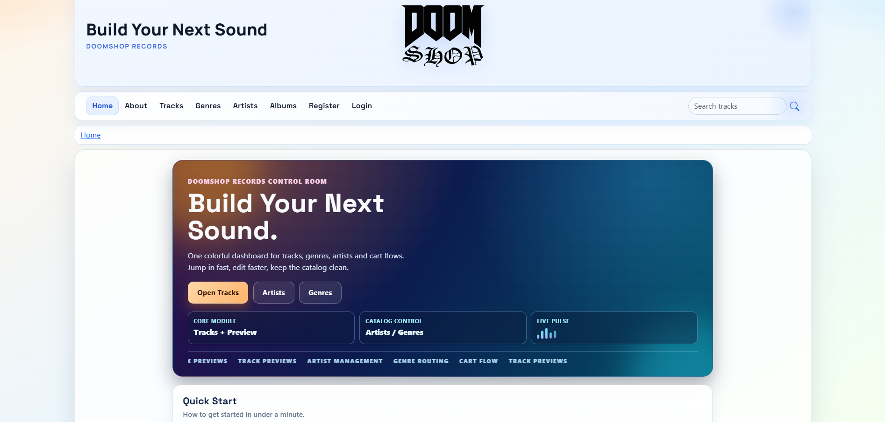
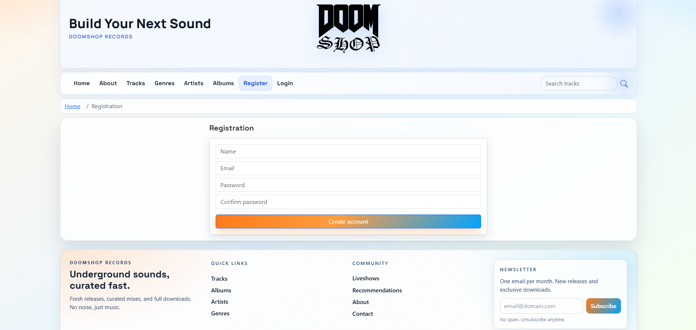
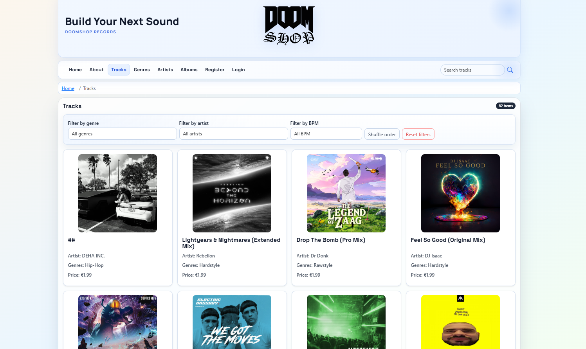
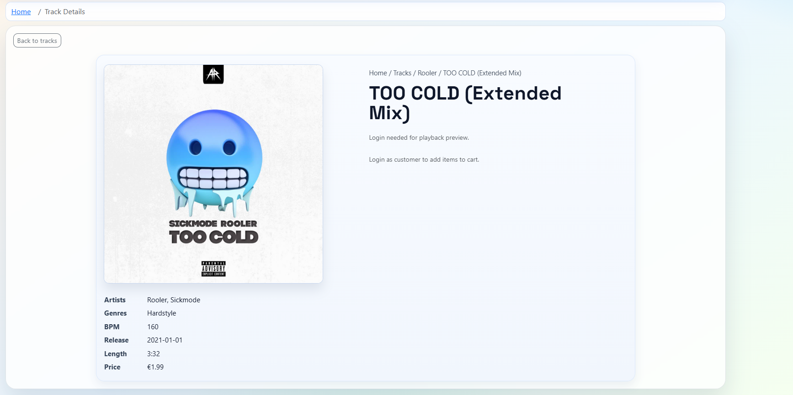
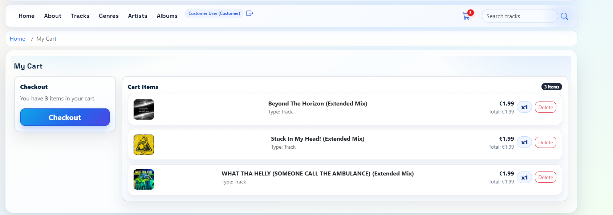
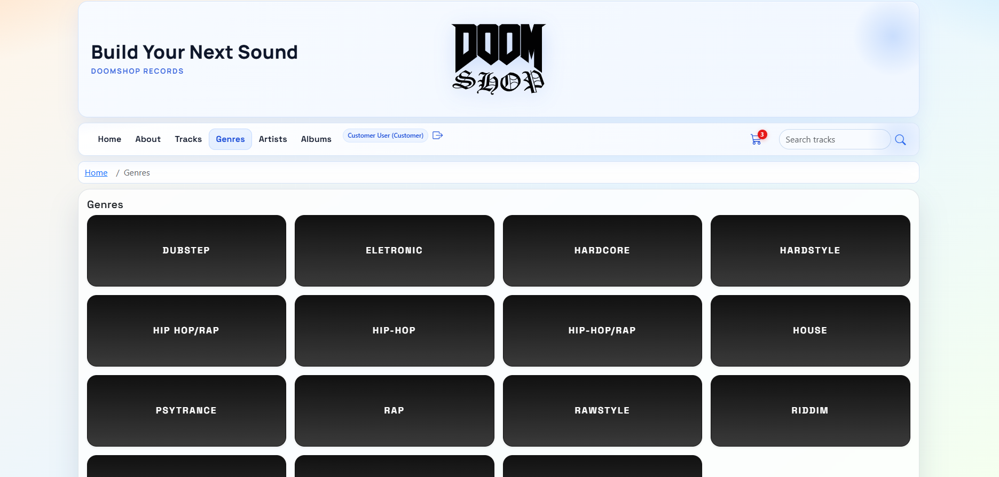
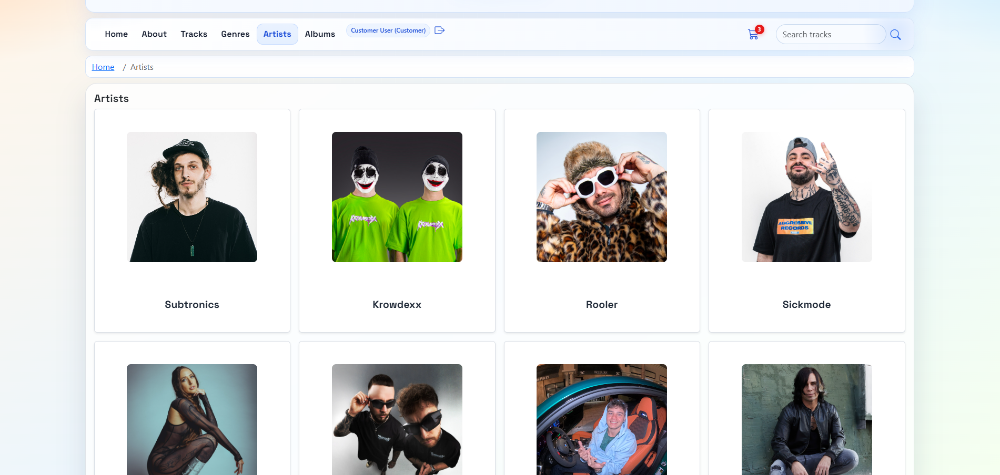
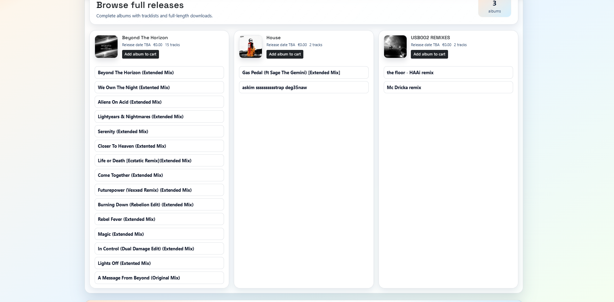

# A szoftver célja, komponenseinek technikai leírása, használatának rövid bemutatása

## A szoftver célja: A feladat rövid leírása
A DOOMSHOP-music egy Laravel + Vue alapú zenei webshop rendszer. A felhasználók zenéket böngészhetnek, előnézetet hallgathatnak, kosárba tehetnek, majd vásárlás után letölthetnek. Az admin felület biztosítja a katalógus (track, artist, genre, album) és a felhasználói adatok kezelését.

## Használatának rövid bemutatása

### Képernyőképekkel, hogy működik a program
- Főoldal: `client/src/views/HomeView.vue`
  
- Bejelentkezés: `client/src/views/LoginView.vue`

- Regisztráció: `client/src/views/RegistrationView.vue`

- Track lista: `client/src/views/TracksView.vue`

- Track részletek: `client/src/views/TrackDetailView.vue`

- Kosár: `client/src/views/MyCartView.vue`

- Műfajok: `client/src/views/GenresView.vue`

- Előadók: `client/src/views/ArtistsView.vue`

- Albumok: `client/src/views/AlbumsView.vue`



## Komponenseinek technikai leírása

### Adatbázis

#### Technológia, használt szoftverek
- MySQL/MariaDB
- Laravel migrációk: `server/database/migrations`
- Seeder-ek: `server/database/seeders`
- Export: `AdatbazisBackup.sql`

#### Diagram
- Adatbázisdiagram: `Diagram.png`

#### Tábla és mezőleírások
Főbb táblák:
- `users` (id, name, email, password, role, ...)
- `genres` (genre_id, genre_name)
- `artists` (artist_id, artist_name, artist_picture)
- `albums` (album_id, album_title, album_cover, ...)
- `tracks` (id, genre_id, track_title, bpm_value, release_date, track_length_sec, track_cover, track_path, preview_start_at, preview_end_at, preview_path, album_id, track_price_eur, ...)
- `track_artists` (track_id, artist_id)
- `track_genres` (track_id, genre_id)
- `carts` (id, user_id, date)
- `cart_items` (id, cart_id, track_id/album_id, pcs)
- `recommendation_links`
- `liveshow_links`

### Backend

#### A technológia
- Laravel 12, PHP 8.2+
- Laravel Sanctum tokenes autentikáció
- FFmpeg feldolgozás: `php-ffmpeg/php-ffmpeg`

#### Laravel, és hogy települ
```bash
cd server
composer install
copy .env.example .env
php artisan key:generate
php artisan migrate --seed
php artisan storage:link
php artisan serve
```

#### A munkához használt Laravel parancsok
- `php artisan serve`
- `php artisan migrate`
- `php artisan db:seed`
- `php artisan migrate --seed`
- `php artisan storage:link`
- `php artisan test`

#### Migráció
- Minta: `server/database/migrations/2025_11_24_114447_create_tracks_table.php`
```php
Schema::create('tracks', function (Blueprint $table) {
    $table->id();
    $table->foreignId('genre_id')->constrained('genres', 'genre_id')->cascadeOnDelete();
    $table->string('track_title');
    $table->integer('bpm_value')->nullable();
    $table->date('release_date')->nullable();
    $table->integer('track_length_sec')->nullable();
    $table->string('track_cover')->nullable();
    $table->string('track_path')->nullable();
    $table->integer('preview_start_at')->default(0);
    $table->integer('preview_end_at')->default(30);
    $table->string('preview_path')->nullable();
});
```

#### Seeder

##### Forrás adatok
- CSV fájlok:
  - `server/database/csv/albums.csv`
  - `server/database/csv/artists.csv`
  - `server/database/csv/genres.csv`
  - `server/database/csv/tracks.csv`
  - `server/database/csv/liveshow_links.csv`
  - `server/database/csv/recommendation_links.csv`

##### Minták
- Felhasználók: `UserSeeder.php` (admin/customer)
- Katalógus adatok: `GenreSeeder.php`, `ArtistSeeder.php`, `AlbumSeeder.php`, `TrackSeeder.php`

##### Seeder szerkezete
- Központi betöltés: `server/database/seeders/DatabaseSeeder.php`

##### Seeder mintakód
```php
$this->call([
    UserSeeder::class,
    GenreSeeder::class,
    ArtistSeeder::class,
    AlbumSeeder::class,
    TrackSeeder::class,
    LiveshowLinkSeeder::class,
    RecommendationLinkSeeder::class,
]);
```

#### Endpointok

##### MiddleWare: védett tartalmak kezelése
- `auth:sanctum` biztosítja a tokenes belépést
- `ability:*` és célzott ability-k szabályozzák a hozzáférést
- Példa: `->middleware(['auth:sanctum', 'ability:admin'])`

##### Minta endpointok kódja, rövid leírása
- `server/routes/api.php`
```php
Route::post('tracks', [TrackController::class, 'store'])
    ->middleware(['auth:sanctum', 'ability:admin']);

Route::get('my-carts', [CartController::class, 'indexSelf'])
    ->middleware(['auth:sanctum', 'ability:carts:self:get']);
```

##### Minta kontroller
- `server/app/Http/Controllers/UserController.php` (login/logout, usersme)

##### Minta model
- `server/app/Models/Track.php`
- `server/app/Models/User.php`

##### Minta validáció (422)
- Request osztályok: `server/app/Http/Requests/*.php`
- Példa: `StoreTrackRequest`, `UpdateUserRequest`

### Autentikáció
- Be- és kijelentkezés endpointok:
  - `POST /api/users/login`
  - `POST /api/users/logout`
- Token: Laravel Sanctum token létrehozás `createToken(...)`
- Jogosultsági szintek:
  - `role=1` admin (`ability:*`)
  - `role=2` customer (saját profil/kosár/checkout ability-k)
  - egyéb szerepkör esetén korlátozott ability-k

### Frontend leírás

#### Milyen modulok
- Oldalnézetek (`views`)
- Újrafelhasználható komponensek (`components`)
- API réteg (`api`)
- Állapotkezelés (`stores` - Pinia)
- Navigáció (`router`)

#### Oldal szerkezet
- Belépési pont: `client/src/main.js`, `client/src/App.vue`
- Head: `router.beforeEach` dinamikusan állítja a `document.title` értéket
- Menü: `client/src/components/Layout/Menu.vue`

#### Jogosultsági rendszer kezelése
- Backend szinten: `auth:sanctum` + `ability` middleware
- Menü szinten: szerepkör alapján megjelenített menüpontok
- Route szinten: `meta.roles` ellenőrzés a router guardban

#### Milyen fájlok
- `client/src/api`
- `client/src/stores` (Pinia)
- `client/src/components`
- `client/src/views`
- `client/src/router/index.js`

#### Program szerkezet: mintakód, rövid leírás
- Kártyák: Bootstrap kártyás megjelenítés a listanézetekben
- Lapozás: `client/src/components/Pagination/Pagination.vue`
- Űrlapok, validálás: `client/src/components/Forms/FormUser.vue`, login/registration komponensek
- Komponensek: Layout, Table, Modal, AudioPlayer almodulok
- Dizájn, reszponzivitás: Bootstrap grid + egyedi CSS (`client/src/assets/main.css`, `my.css`)

## Forráslista a munkához
- Laravel dokumentáció: https://laravel.com/docs
- Laravel Sanctum: https://laravel.com/docs/sanctum
- Vue 3 dokumentáció: https://vuejs.org
- Vue Router: https://router.vuejs.org
- Pinia: https://pinia.vuejs.org
- Vite: https://vite.dev
- Vitest: https://vitest.dev
- Cypress: https://www.cypress.io
- Bootstrap: https://getbootstrap.com
